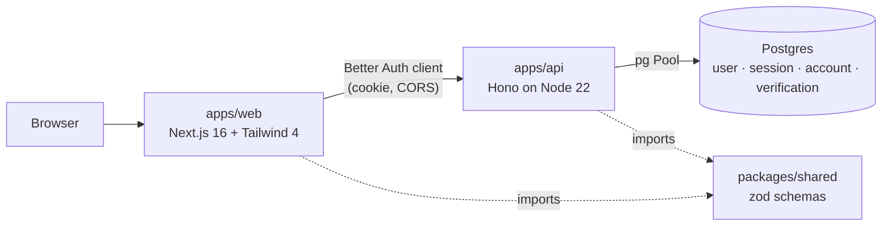

# System overview (Chapter 1)

```mermaid
flowchart LR
  B["Browser"] --> WEB["apps/web<br/>Next.js 16 + Tailwind 4"]
  WEB -- "Better Auth client<br/>(cookie, CORS)" --> API["apps/api<br/>Hono on Node 22"]
  API -- "pg Pool" --> PG[("Postgres<br/>user · session · account · verification")]
  WEB -. imports .-> SH["packages/shared<br/>zod schemas"]
  API -. imports .-> SH
```

Later chapters add storage (Ch. 3), queues (Ch. 5) and five worker services (Ch. 6–10).
