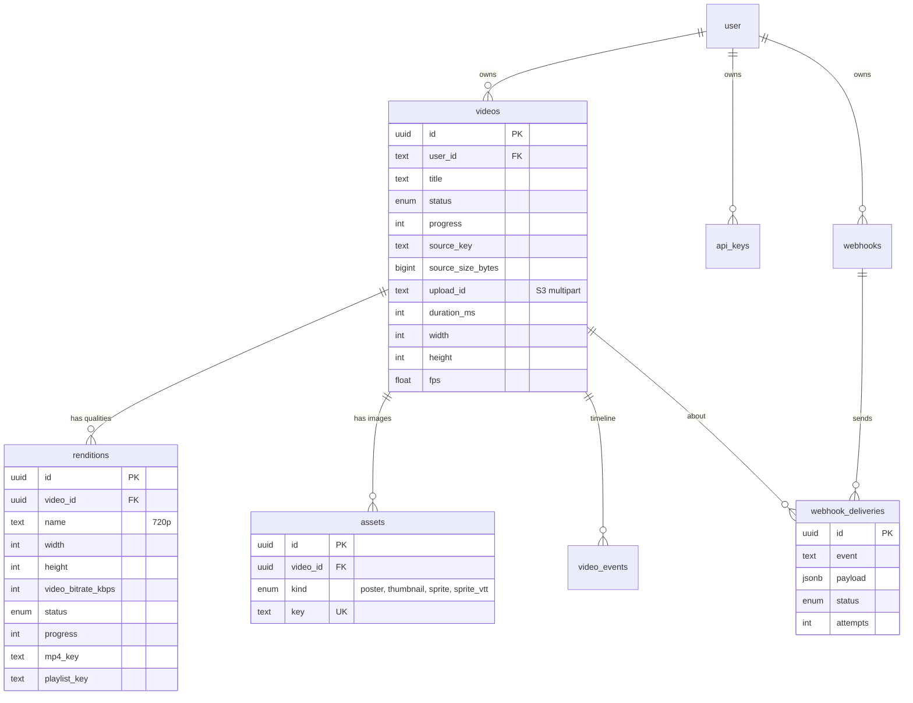

# Data model (Chapter 2)

```mermaid
erDiagram
  user ||--o{ videos : owns
  user ||--o{ api_keys : owns
  user ||--o{ webhooks : owns
  videos ||--o{ renditions : "has qualities"
  videos ||--o{ assets : "has images"
  videos ||--o{ video_events : "timeline"
  webhooks ||--o{ webhook_deliveries : sends
  videos ||--o{ webhook_deliveries : about

  videos {
    uuid id PK
    text user_id FK
    text title
    enum status
    int progress
    text source_key
    bigint source_size_bytes
    text upload_id "S3 multipart"
    int duration_ms
    int width
    int height
    float fps
  }
  renditions {
    uuid id PK
    uuid video_id FK
    text name "720p"
    int width
    int height
    int video_bitrate_kbps
    enum status
    int progress
    text mp4_key
    text playlist_key
  }
  assets {
    uuid id PK
    uuid video_id FK
    enum kind "poster, thumbnail, sprite, sprite_vtt"
    text key UK
  }
  webhook_deliveries {
    uuid id PK
    text event
    jsonb payload
    enum status
    int attempts
  }
```
