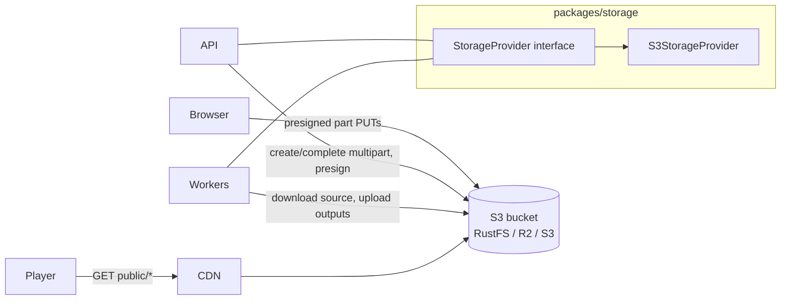
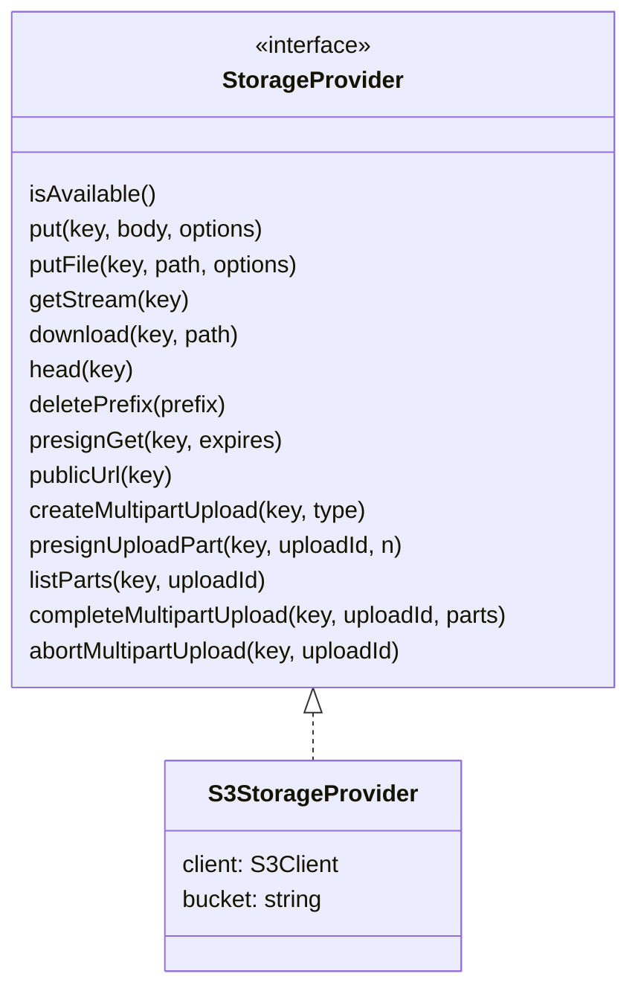

# Storage layer

```mermaid
flowchart LR
  Browser -- presigned part PUTs --> Bucket[(S3 bucket<br/>RustFS / R2 / S3)]
  API -- create/complete multipart, presign --> Bucket
  Workers -- download source, upload outputs --> Bucket
  Player -- GET public/* --> CDN --> Bucket
  subgraph packages/storage
    SP[StorageProvider interface] --> S3[S3StorageProvider]
  end
  API --- SP
  Workers --- SP
```

```mermaid
classDiagram
  class StorageProvider {
    <<interface>>
    isAvailable()
    put(key, body, options)
    putFile(key, path, options)
    getStream(key)
    download(key, path)
    head(key)
    deletePrefix(prefix)
    presignGet(key, expires)
    publicUrl(key)
    createMultipartUpload(key, type)
    presignUploadPart(key, uploadId, n)
    listParts(key, uploadId)
    completeMultipartUpload(key, uploadId, parts)
    abortMultipartUpload(key, uploadId)
  }
  class S3StorageProvider {
    client: S3Client
    bucket: string
  }
  StorageProvider <|.. S3StorageProvider
```
