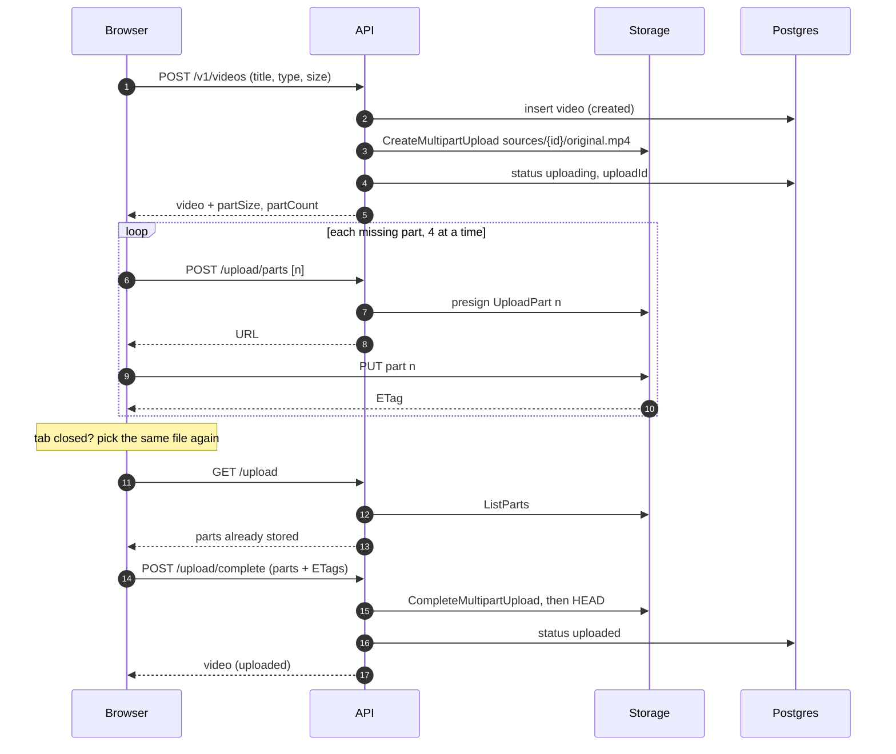
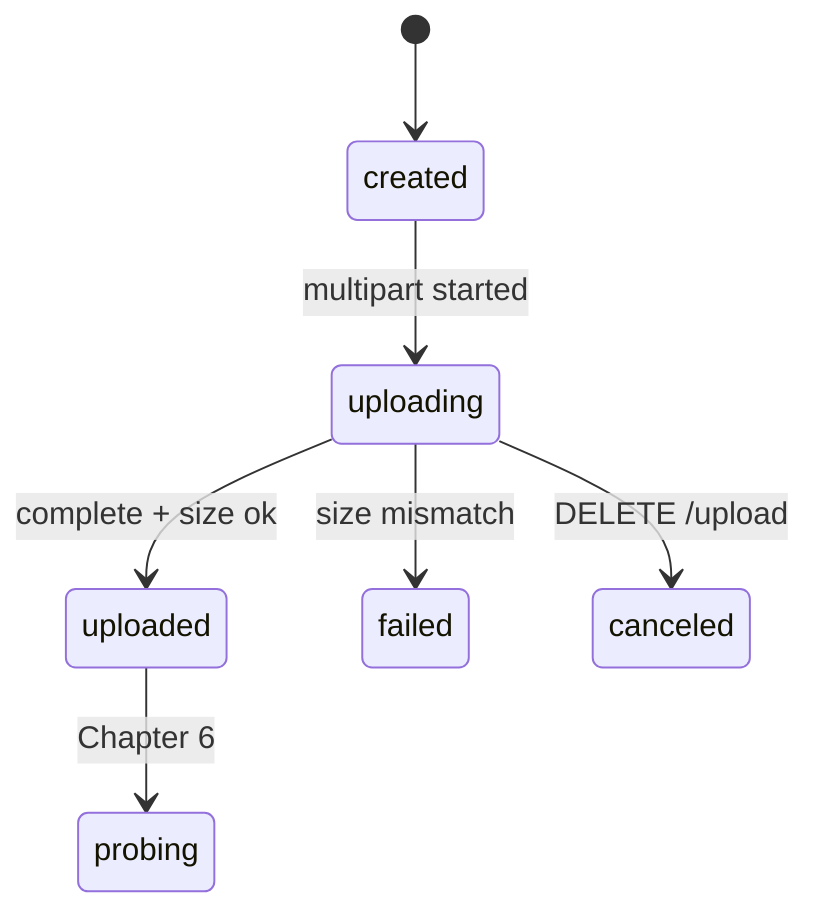

# Upload sequence

```mermaid
sequenceDiagram
  autonumber
  participant B as Browser
  participant A as API
  participant S as Storage
  participant D as Postgres
  B->>A: POST /v1/videos (title, type, size)
  A->>D: insert video (created)
  A->>S: CreateMultipartUpload sources/{id}/original.mp4
  A->>D: status uploading, uploadId
  A-->>B: video + partSize, partCount
  loop each missing part, 4 at a time
    B->>A: POST /upload/parts [n]
    A->>S: presign UploadPart n
    A-->>B: URL
    B->>S: PUT part n
    S-->>B: ETag
  end
  Note over B: tab closed? pick the same file again
  B->>A: GET /upload
  A->>S: ListParts
  A-->>B: parts already stored
  B->>A: POST /upload/complete (parts + ETags)
  A->>S: CompleteMultipartUpload, then HEAD
  A->>D: status uploaded
  A-->>B: video (uploaded)
```

```mermaid
stateDiagram-v2
  [*] --> created
  created --> uploading: multipart started
  uploading --> uploaded: complete + size ok
  uploading --> failed: size mismatch
  uploading --> canceled: DELETE /upload
  uploaded --> probing: Chapter 6
```
