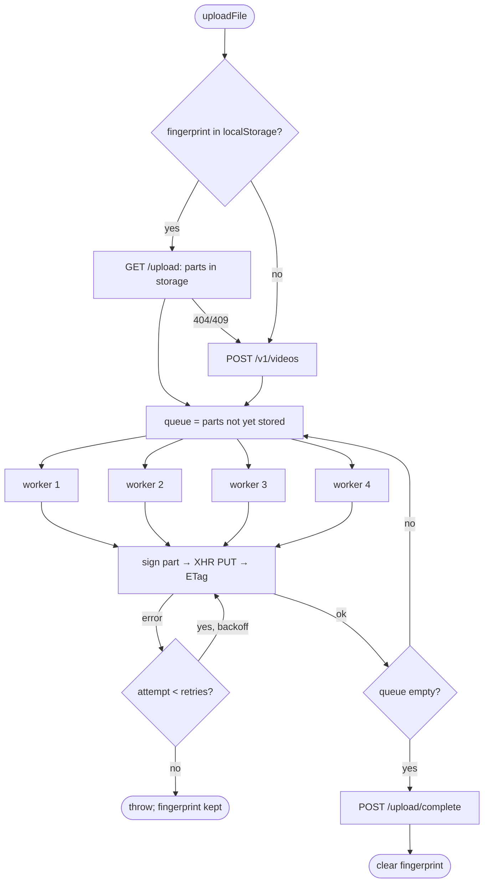

# Uploader internals

```mermaid
flowchart TD
  Start([uploadFile]) --> FP{fingerprint in localStorage?}
  FP -- yes --> Status[GET /upload: parts in storage]
  Status -- 404/409 --> Create
  FP -- no --> Create[POST /v1/videos]
  Status --> Queue
  Create --> Queue[queue = parts not yet stored]
  Queue --> W1[worker 1]
  Queue --> W2[worker 2]
  Queue --> W3[worker 3]
  Queue --> W4[worker 4]
  W1 & W2 & W3 & W4 --> Send[sign part → XHR PUT → ETag]
  Send -- error --> Retry{attempt < retries?}
  Retry -- yes, backoff --> Send
  Retry -- no --> Fail([throw; fingerprint kept])
  Send -- ok --> Done{queue empty?}
  Done -- no --> Queue
  Done -- yes --> Complete[POST /upload/complete] --> Clear([clear fingerprint])
```
