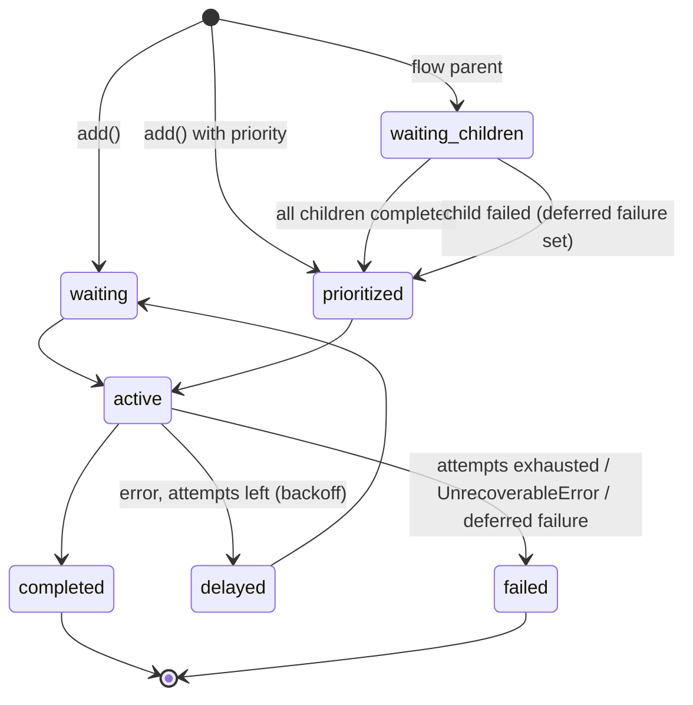
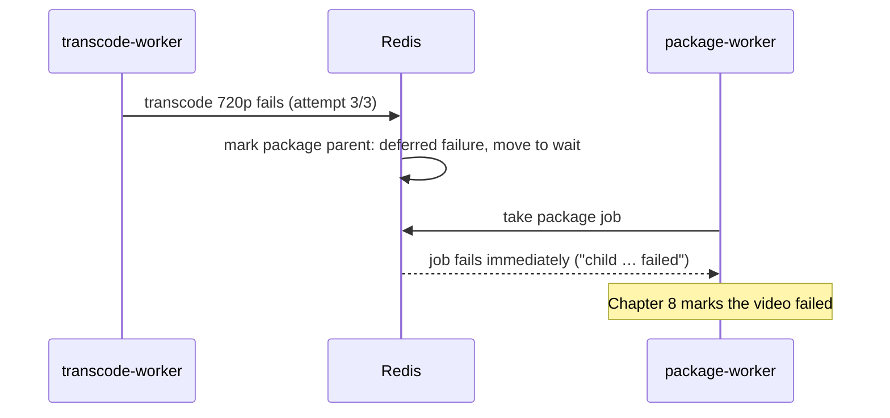

# Job lifecycle

```mermaid
stateDiagram-v2
  [*] --> waiting: add()
  [*] --> prioritized: add() with priority
  [*] --> waiting_children: flow parent
  waiting_children --> prioritized: all children completed
  waiting_children --> prioritized: child failed (deferred failure set)
  waiting --> active
  prioritized --> active
  active --> completed
  active --> delayed: error, attempts left (backoff)
  delayed --> waiting
  active --> failed: attempts exhausted / UnrecoverableError / deferred failure
  completed --> [*]
  failed --> [*]
```

```mermaid
sequenceDiagram
  participant T as transcode-worker
  participant R as Redis
  participant P as package-worker
  T->>R: transcode 720p fails (attempt 3/3)
  R->>R: mark package parent: deferred failure, move to wait
  P->>R: take package job
  R-->>P: job fails immediately ("child … failed")
  Note over P: Chapter 8 marks the video failed
```
