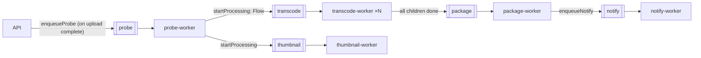
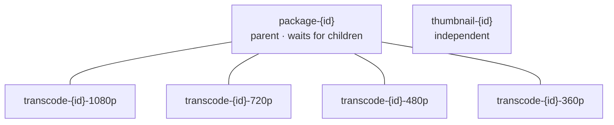

# Queues and flow

```mermaid
flowchart LR
  API -- "enqueueProbe (on upload complete)" --> PQ[[probe]]
  PQ --> PW[probe-worker]
  PW -- "startProcessing: Flow" --> TQ[[transcode]]
  PW -- startProcessing --> ThQ[[thumbnail]]
  TQ --> TW[transcode-worker ×N]
  TW -- "all children done" --> PkQ[[package]]
  PkQ --> PkW[package-worker]
  ThQ --> ThW[thumbnail-worker]
  PkW -- enqueueNotify --> NQ[[notify]]
  NQ --> NW[notify-worker]
```

```mermaid
flowchart TD
  P["package-{id}<br/>parent · waits for children"]
  P --- A["transcode-{id}-1080p"]
  P --- B["transcode-{id}-720p"]
  P --- C["transcode-{id}-480p"]
  P --- D["transcode-{id}-360p"]
  T["thumbnail-{id}<br/>independent"]
```
