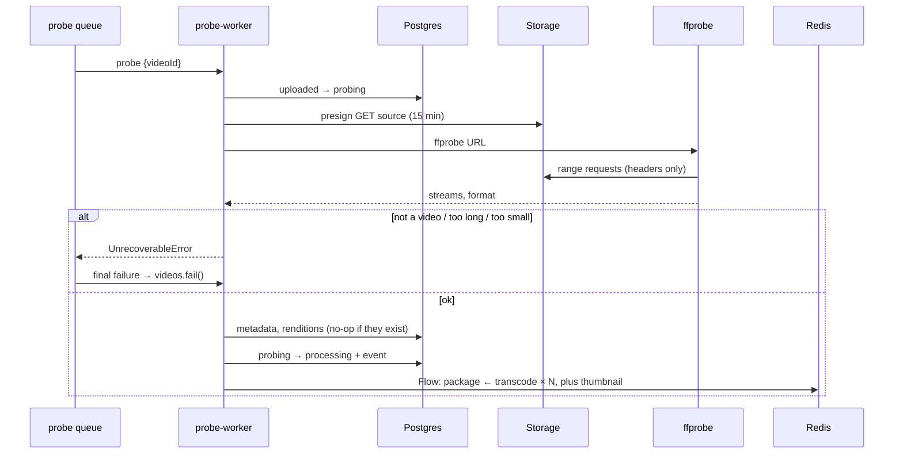
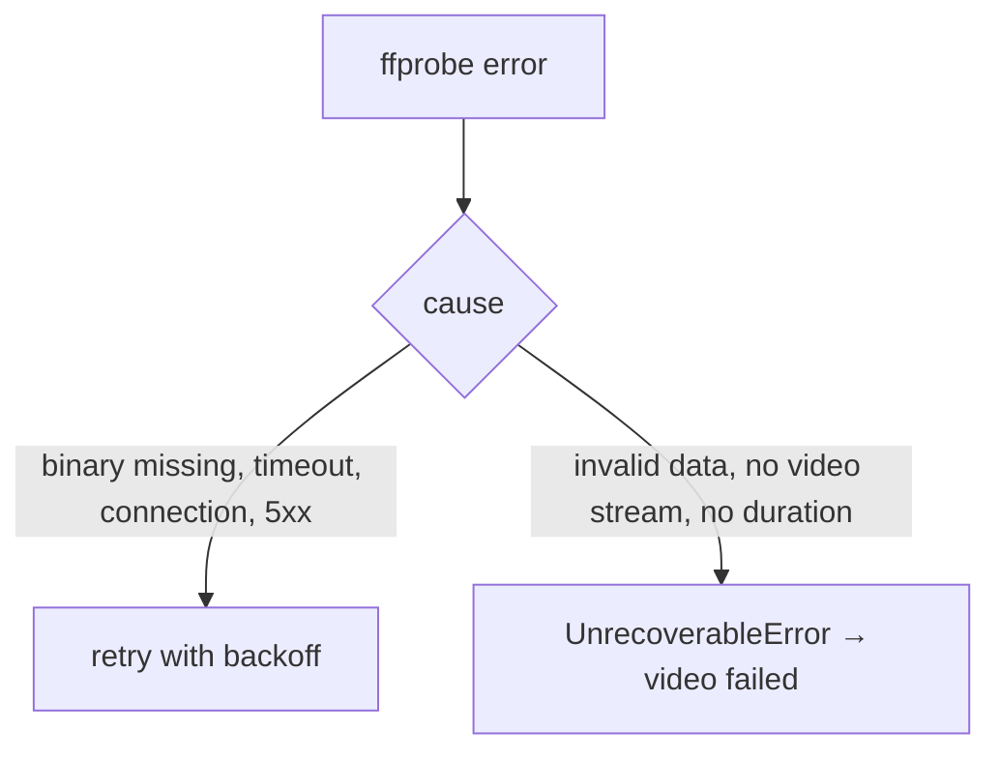

# Probe stage

```mermaid
sequenceDiagram
  participant Q as probe queue
  participant W as probe-worker
  participant D as Postgres
  participant S as Storage
  participant F as ffprobe
  participant R as Redis
  Q->>W: probe {videoId}
  W->>D: uploaded → probing
  W->>S: presign GET source (15 min)
  W->>F: ffprobe URL
  F->>S: range requests (headers only)
  F-->>W: streams, format
  alt not a video / too long / too small
    W-->>Q: UnrecoverableError
    Q->>W: final failure → videos.fail()
  else ok
    W->>D: metadata, renditions (no-op if they exist)
    W->>D: probing → processing + event
    W->>R: Flow: package ← transcode × N, plus thumbnail
  end
```

```mermaid
flowchart TD
  E[ffprobe error] --> M{cause}
  M -- "binary missing, timeout, connection, 5xx" --> T[retry with backoff]
  M -- "invalid data, no video stream, no duration" --> U[UnrecoverableError → video failed]
```
