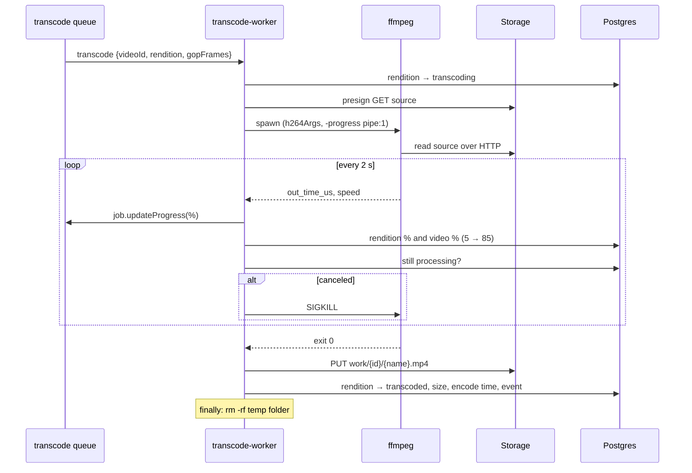
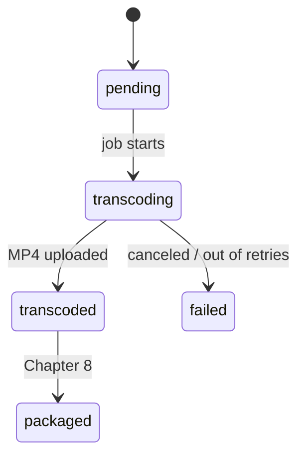

# Transcode job

```mermaid
sequenceDiagram
  participant Q as transcode queue
  participant W as transcode-worker
  participant F as ffmpeg
  participant S as Storage
  participant D as Postgres
  Q->>W: transcode {videoId, rendition, gopFrames}
  W->>D: rendition → transcoding
  W->>S: presign GET source
  W->>F: spawn (h264Args, -progress pipe:1)
  F->>S: read source over HTTP
  loop every 2 s
    F-->>W: out_time_us, speed
    W->>Q: job.updateProgress(%)
    W->>D: rendition % and video % (5 → 85)
    W->>D: still processing?
    alt canceled
      W->>F: SIGKILL
    end
  end
  F-->>W: exit 0
  W->>S: PUT work/{id}/{name}.mp4
  W->>D: rendition → transcoded, size, encode time, event
  Note over W: finally: rm -rf temp folder
```

```mermaid
stateDiagram-v2
  [*] --> pending
  pending --> transcoding: job starts
  transcoding --> transcoded: MP4 uploaded
  transcoding --> failed: canceled / out of retries
  transcoded --> packaged: Chapter 8
```
