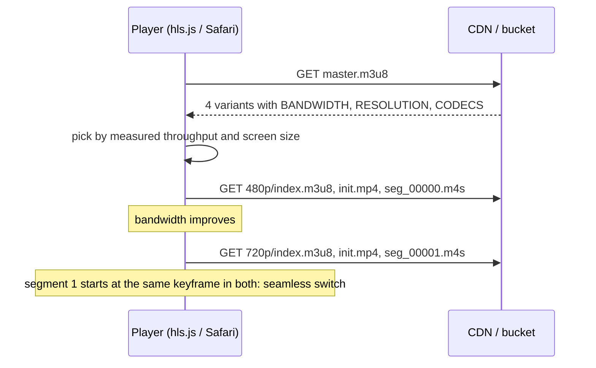

# Adaptive streaming

```mermaid
sequenceDiagram
  participant Pl as Player (hls.js / Safari)
  participant C as CDN / bucket
  Pl->>C: GET master.m3u8
  C-->>Pl: 4 variants with BANDWIDTH, RESOLUTION, CODECS
  Pl->>Pl: pick by measured throughput and screen size
  Pl->>C: GET 480p/index.m3u8, init.mp4, seg_00000.m4s
  Note over Pl: bandwidth improves
  Pl->>C: GET 720p/index.m3u8, init.mp4, seg_00001.m4s
  Note over Pl: segment 1 starts at the same keyframe in both: seamless switch
```
