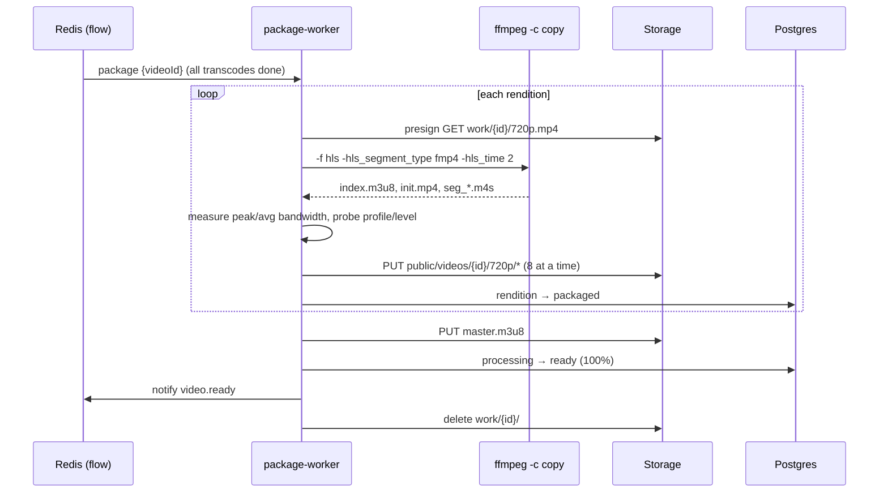
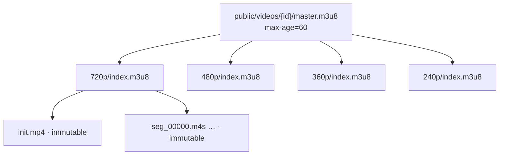

# Packaging

```mermaid
sequenceDiagram
  participant R as Redis (flow)
  participant P as package-worker
  participant F as ffmpeg -c copy
  participant S as Storage
  participant D as Postgres
  R->>P: package {videoId} (all transcodes done)
  loop each rendition
    P->>S: presign GET work/{id}/720p.mp4
    P->>F: -f hls -hls_segment_type fmp4 -hls_time 2
    F-->>P: index.m3u8, init.mp4, seg_*.m4s
    P->>P: measure peak/avg bandwidth, probe profile/level
    P->>S: PUT public/videos/{id}/720p/* (8 at a time)
    P->>D: rendition → packaged
  end
  P->>S: PUT master.m3u8
  P->>D: processing → ready (100%)
  P->>R: notify video.ready
  P->>S: delete work/{id}/
```

```mermaid
flowchart TD
  M["public/videos/{id}/master.m3u8<br/>max-age=60"] --> A["720p/index.m3u8"]
  M --> B["480p/index.m3u8"]
  M --> C["360p/index.m3u8"]
  M --> D["240p/index.m3u8"]
  A --> AI["init.mp4 · immutable"]
  A --> AS["seg_00000.m4s … · immutable"]
```
