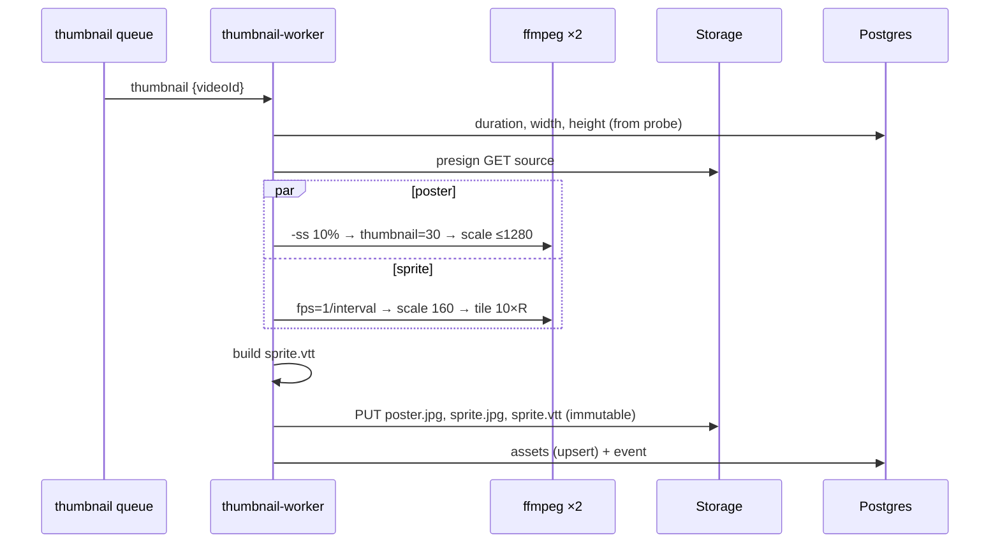

# Thumbnail job

```mermaid
sequenceDiagram
  participant Q as thumbnail queue
  participant W as thumbnail-worker
  participant F as ffmpeg ×2
  participant S as Storage
  participant D as Postgres
  Q->>W: thumbnail {videoId}
  W->>D: duration, width, height (from probe)
  W->>S: presign GET source
  par poster
    W->>F: -ss 10% → thumbnail=30 → scale ≤1280
  and sprite
    W->>F: fps=1/interval → scale 160 → tile 10×R
  end
  W->>W: build sprite.vtt
  W->>S: PUT poster.jpg, sprite.jpg, sprite.vtt (immutable)
  W->>D: assets (upsert) + event
```
