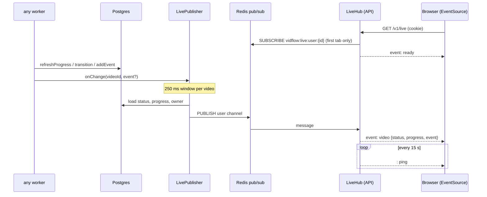

# Live updates

```mermaid
sequenceDiagram
  participant W as any worker
  participant D as Postgres
  participant P as LivePublisher
  participant R as Redis pub/sub
  participant H as LiveHub (API)
  participant B as Browser (EventSource)
  B->>H: GET /v1/live (cookie)
  H->>R: SUBSCRIBE vidflow:live:user:{id} (first tab only)
  H-->>B: event: ready
  W->>D: refreshProgress / transition / addEvent
  W->>P: onChange(videoId, event?)
  Note over P: 250 ms window per video
  P->>D: load status, progress, owner
  P->>R: PUBLISH user channel
  R->>H: message
  H-->>B: event: video {status, progress, event}
  loop every 15 s
    H-->>B: : ping
  end
```
