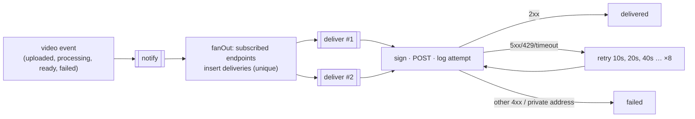
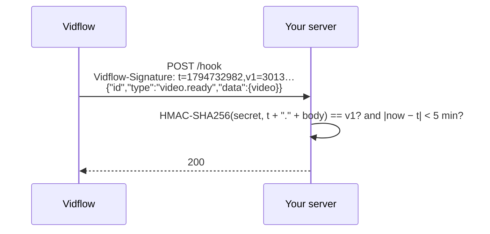

# Webhooks

```mermaid
flowchart LR
  E["video event<br/>(uploaded, processing, ready, failed)"] --> N[[notify]]
  N --> F["fanOut: subscribed endpoints<br/>insert deliveries (unique)"]
  F --> D1[[deliver #1]]
  F --> D2[[deliver #2]]
  D1 --> S["sign · POST · log attempt"]
  D2 --> S
  S -- 2xx --> OK[delivered]
  S -- "5xx/429/timeout" --> RB["retry 10s, 20s, 40s … ×8"] --> S
  S -- "other 4xx / private address" --> X[failed]
```

```mermaid
sequenceDiagram
  participant V as Vidflow
  participant R as Your server
  V->>R: POST /hook<br/>Vidflow-Signature: t=1794732982,v1=3013…<br/>{"id","type":"video.ready","data":{video}}
  R->>R: HMAC-SHA256(secret, t + "." + body) == v1? and |now − t| < 5 min?
  R-->>V: 200
```
