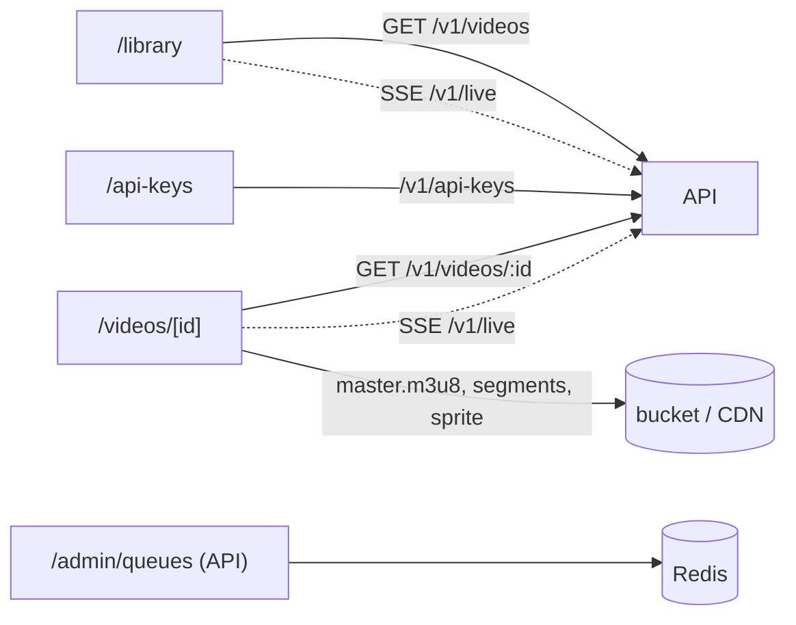
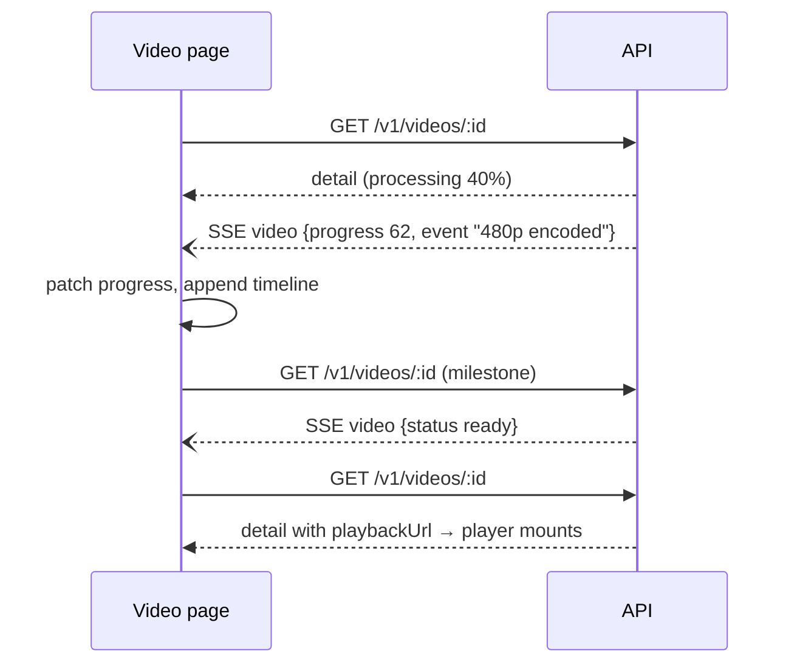

# Pages and data

```mermaid
flowchart LR
  Lib["/library"] -- "GET /v1/videos" --> API
  Vid["/videos/[id]"] -- "GET /v1/videos/:id" --> API
  Keys["/api-keys"] -- "/v1/api-keys" --> API
  Lib -. "SSE /v1/live" .-> API
  Vid -. "SSE /v1/live" .-> API
  Vid -- "master.m3u8, segments, sprite" --> CDN[(bucket / CDN)]
  Admin["/admin/queues (API)"] --> Redis[(Redis)]
```

```mermaid
sequenceDiagram
  participant B as Video page
  participant A as API
  B->>A: GET /v1/videos/:id
  A-->>B: detail (processing 40%)
  A--)B: SSE video {progress 62, event "480p encoded"}
  B->>B: patch progress, append timeline
  B->>A: GET /v1/videos/:id (milestone)
  A--)B: SSE video {status ready}
  B->>A: GET /v1/videos/:id
  A-->>B: detail with playbackUrl → player mounts
```
