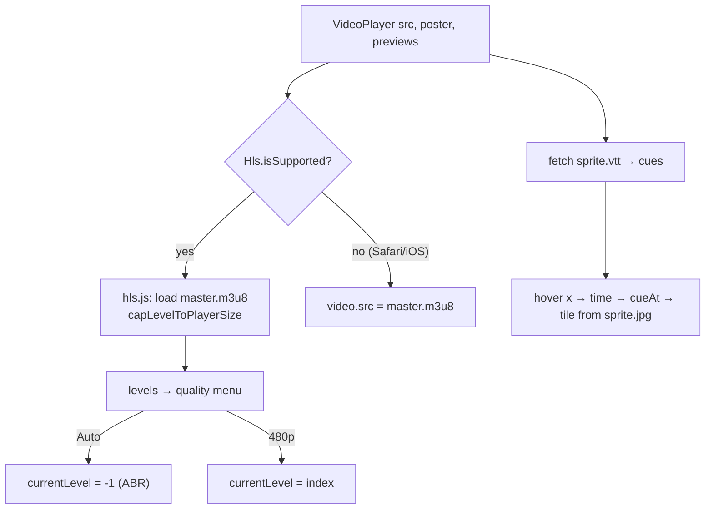

# Player

```mermaid
flowchart TD
  P[VideoPlayer src, poster, previews] --> S{Hls.isSupported?}
  S -- yes --> H["hls.js: load master.m3u8<br/>capLevelToPlayerSize"]
  S -- "no (Safari/iOS)" --> N[video.src = master.m3u8]
  H --> L[levels → quality menu]
  L -- Auto --> A["currentLevel = -1 (ABR)"]
  L -- 480p --> F[currentLevel = index]
  P --> V[fetch sprite.vtt → cues]
  V --> Hov["hover x → time → cueAt → tile from sprite.jpg"]
```
