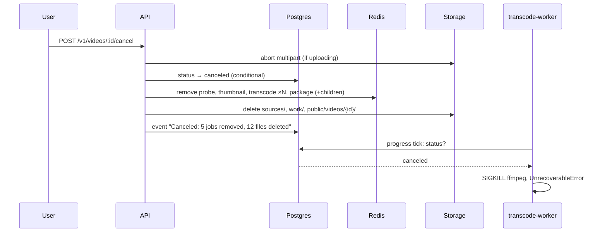

# Cancel and delete

```mermaid
sequenceDiagram
  participant U as User
  participant A as API
  participant D as Postgres
  participant R as Redis
  participant S as Storage
  participant W as transcode-worker
  U->>A: POST /v1/videos/:id/cancel
  A->>S: abort multipart (if uploading)
  A->>D: status → canceled (conditional)
  A->>R: remove probe, thumbnail, transcode ×N, package (+children)
  A->>S: delete sources/, work/, public/videos/{id}/
  A->>D: event "Canceled: 5 jobs removed, 12 files deleted"
  W->>D: progress tick: status?
  D-->>W: canceled
  W->>W: SIGKILL ffmpeg, UnrecoverableError
```
