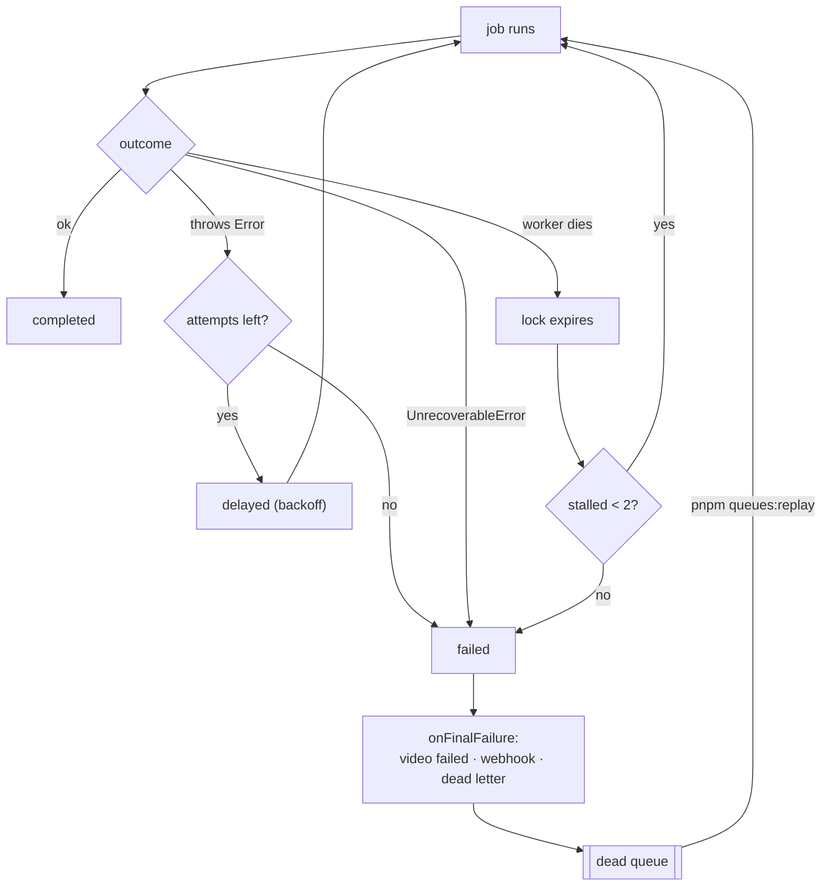

# Failure paths

```mermaid
flowchart TD
  A[job runs] --> R{outcome}
  R -- ok --> C[completed]
  R -- "throws Error" --> T{attempts left?}
  T -- yes --> D["delayed (backoff)"] --> A
  T -- no --> F[failed]
  R -- UnrecoverableError --> F
  R -- "worker dies" --> L["lock expires"] --> S{"stalled < 2?"}
  S -- yes --> A
  S -- no --> F
  F --> H["onFinalFailure:<br/>video failed · webhook · dead letter"]
  H --> Q[["dead queue"]]
  Q -- "pnpm queues:replay" --> A
```
