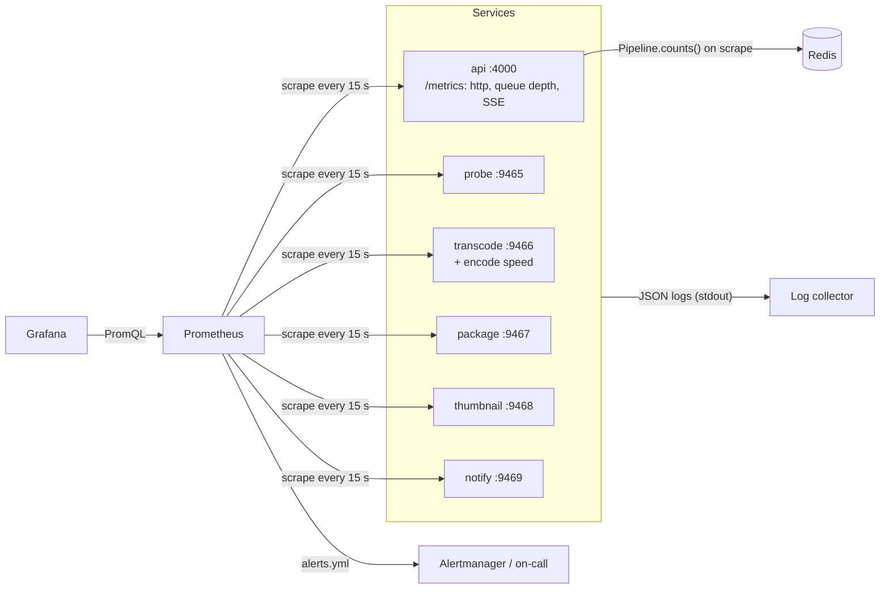
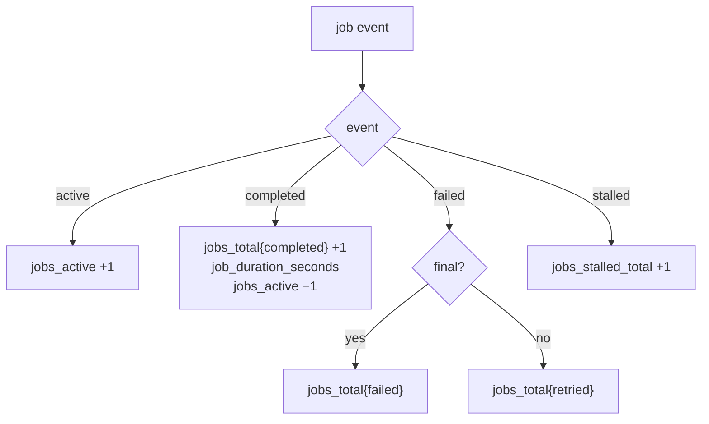

# Telemetry flow

```mermaid
flowchart LR
  subgraph Services
    API["api :4000<br/>/metrics: http, queue depth, SSE"]
    P["probe :9465"]
    T["transcode :9466<br/>+ encode speed"]
    K["package :9467"]
    H["thumbnail :9468"]
    N["notify :9469"]
  end
  API -- "Pipeline.counts() on scrape" --> R[(Redis)]
  Prom[Prometheus] -- "scrape every 15 s" --> API & P & T & K & H & N
  Prom -- "alerts.yml" --> AM[Alertmanager / on-call]
  G[Grafana] -- PromQL --> Prom
  Services -- "JSON logs (stdout)" --> L[Log collector]
```

```mermaid
flowchart TD
  J[job event] --> A{event}
  A -- active --> G1["jobs_active +1"]
  A -- completed --> C["jobs_total{completed} +1<br/>job_duration_seconds<br/>jobs_active −1"]
  A -- failed --> F{"final?"}
  F -- yes --> FF["jobs_total{failed}"]
  F -- no --> FR["jobs_total{retried}"]
  A -- stalled --> S["jobs_stalled_total +1"]
```
