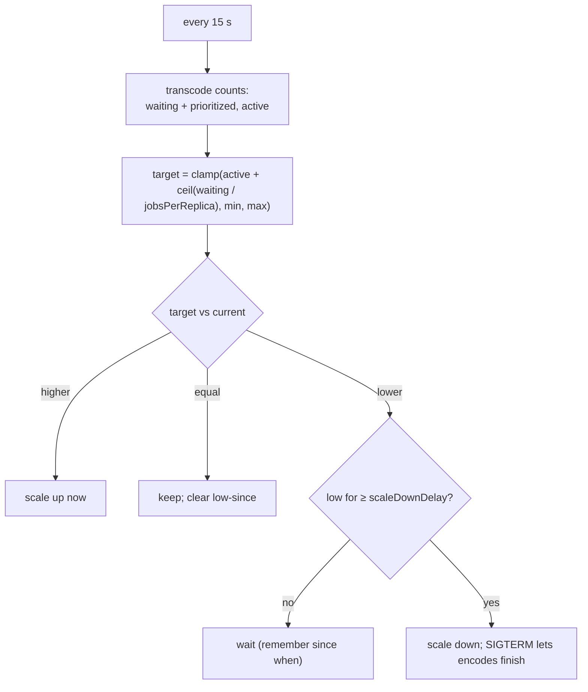
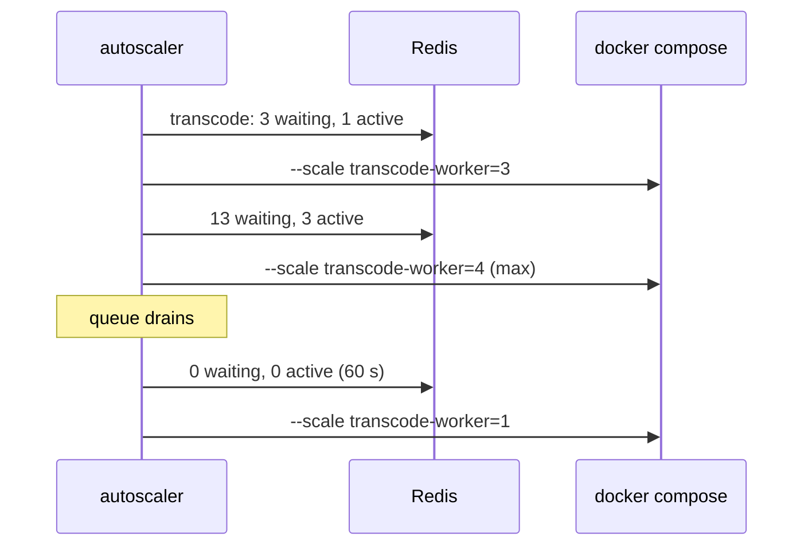

# Autoscaling

```mermaid
flowchart TD
  T["every 15 s"] --> C["transcode counts:<br/>waiting + prioritized, active"]
  C --> D["target = clamp(active + ceil(waiting / jobsPerReplica), min, max)"]
  D --> X{target vs current}
  X -- higher --> UP["scale up now"]
  X -- equal --> K["keep; clear low-since"]
  X -- lower --> L{"low for ≥ scaleDownDelay?"}
  L -- no --> W["wait (remember since when)"]
  L -- yes --> DN["scale down; SIGTERM lets encodes finish"]
```

```mermaid
sequenceDiagram
  participant A as autoscaler
  participant R as Redis
  participant D as docker compose
  A->>R: transcode: 3 waiting, 1 active
  A->>D: --scale transcode-worker=3
  A->>R: 13 waiting, 3 active
  A->>D: --scale transcode-worker=4 (max)
  Note over A: queue drains
  A->>R: 0 waiting, 0 active (60 s)
  A->>D: --scale transcode-worker=1
```
