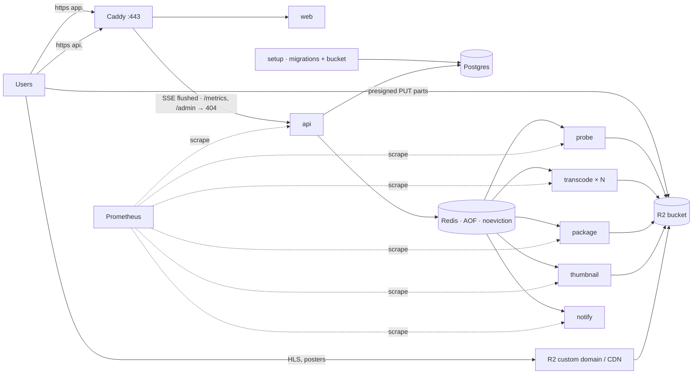

# Production topology

```mermaid
flowchart LR
  U[Users] -- "https app." --> C[Caddy :443]
  U -- "https api." --> C
  U -- "HLS, posters" --> CDN["R2 custom domain / CDN"]
  U -- "presigned PUT parts" --> R2[(R2 bucket)]
  C --> W[web]
  C -- "SSE flushed · /metrics, /admin → 404" --> A[api]
  S[setup · migrations + bucket] --> PG[(Postgres)]
  A --> PG
  A --> RD[(Redis · AOF · noeviction)]
  RD --> PW[probe] & TW["transcode × N"] & KW[package] & HW[thumbnail] & NW[notify]
  PW & TW & KW & HW --> R2
  CDN --> R2
  P[Prometheus] -. scrape .-> A & PW & TW & KW & HW & NW
```
